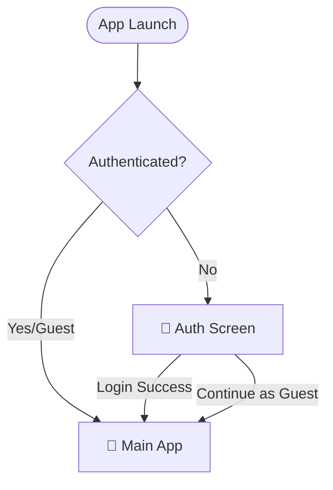
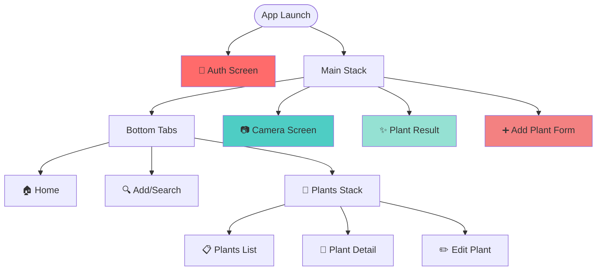
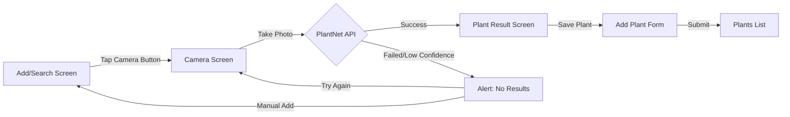
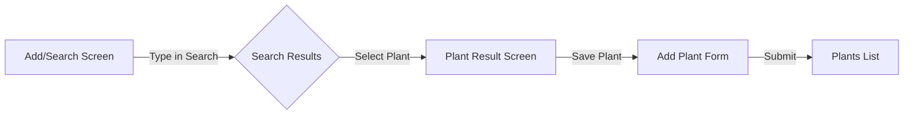
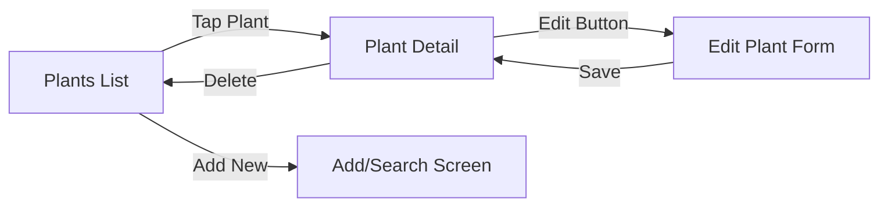
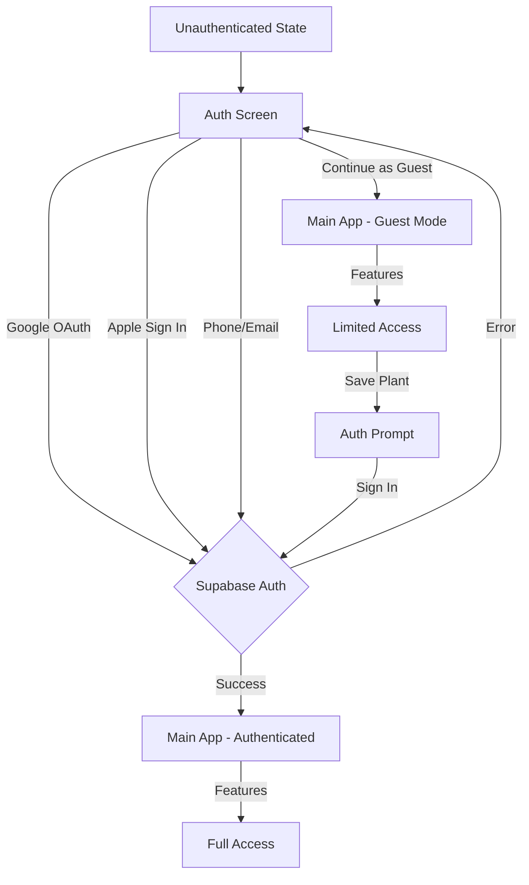
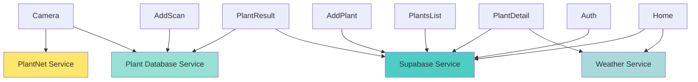

# 🌿 Lotus App - Complete Flow Diagram

**Generated:** 2025-12-28
**Purpose:** Pre-Beta Testing - Complete App Flow Mapping

---

## 📱 App Entry Points

---

## 🗺️ Complete Navigation Architecture

---

## 🔄 User Flows

### Flow 1: Plant Identification (Camera)

**Navigation Calls:**
- `AddScanScreen` → `navigation.navigate('Camera')` (line 136)
- `ScanScreen` → `navigation.navigate('PlantResult', {...})` (line 198)
- `PlantResultScreen` → `navigation.navigate('AddPlant', {...})` (line 229, 518)

---

### Flow 2: Manual Plant Addition (Search Database)

**Navigation Calls:**
- `AddScanScreen` → `navigation.navigate('PlantResult', {...})` (line 105)
- Uses `database_match` object to indicate 100% confidence match

---

### Flow 3: View & Manage Plants

**Navigation Calls:**
- `PlantsScreen` → `navigation.navigate('PlantDetail', { plantId })` (line 85)
- `PlantDetailScreen` → `navigation.navigate('EditPlant', { plantId })` (line 524)

---

### Flow 4: Authentication Flow

**Navigation Calls:**
- `PlantResultScreen` → `navigation.navigate('Auth')` (line 531 - when trying to save without auth)
- Auth state managed by `AppNavigator.tsx` (lines 130-155)

---

## 🎯 Critical User Journeys

### Journey A: First-Time User → Add First Plant (Camera)
1. **App Launch** → Auth Screen
2. **Continue as Guest** → Home Screen
3. **Tap "Add" Tab** → Add/Search Screen
4. **Tap Camera Button** → Camera Screen
5. **Take Photo** → PlantNet API Call
6. **View Results** → Plant Result Screen
7. **Tap "Add to Garden"** → Auth Prompt (if guest)
8. **Sign In** → Add Plant Form
9. **Fill Details & Save** → Plants List

### Journey B: First-Time User → Add First Plant (Manual Search)
1. **App Launch** → Auth Screen
2. **Continue as Guest** → Home Screen
3. **Tap "Add" Tab** → Add/Search Screen
4. **Type Plant Name** → Search Results
5. **Select Plant** → Plant Result Screen (100% confidence)
6. **Tap "Add to Garden"** → Auth Prompt (if guest)
7. **Sign In** → Add Plant Form
8. **Fill Details & Save** → Plants List

### Journey C: Returning User → View Plant Details
1. **App Launch** → Home Screen (auto-login)
2. **Tap "Plants" Tab** → Plants List
3. **Tap Plant Card** → Plant Detail Screen
4. **View Care Info** → Watering, light, humidity, etc.

---

## 📊 Screen Dependency Map

---

## 🔍 Potential Issues Found

### 1. **Duplicate Screen in Navigation**
- ❌ `AddScanScreen` appears TWICE in navigation:
  - In `MainTabs` as "Scan" tab (line 110-116)
  - In `MainStack` as "AddScan" route (line 46)
- ⚠️ This creates confusion and potential navigation bugs

### 2. **Orphaned Screen**
- ❌ `SettingsScreen.tsx` exists in codebase but NOT in navigation
- File exists: `/src/screens/SettingsScreen.tsx`
- Not referenced in `AppNavigator.tsx`

### 3. **Inconsistent Navigation Patterns**
- ⚠️ Some screens use `navigation.navigate()` directly
- ⚠️ Others use callback functions like `navigateToPlantDetail()`
- ⚠️ Mixed patterns can lead to maintenance issues

### 4. **Auth Flow Edge Case**
- ⚠️ Guest users can browse but hit auth wall when saving
- ⚠️ After auth, user is NOT returned to previous flow
- Missing: Return to `PlantResultScreen` after auth completion

### 5. **TypeScript Ignored**
- ❌ Multiple `@ts-ignore` comments in `AppNavigator.tsx`
- Lines: 30, 42, 58, 136
- Reason: "Navigation types are working correctly at runtime"
- Risk: Type safety bypassed, potential runtime errors

---

## 📱 Screen Inventory

| Screen | Location | Purpose | Entry Points |
|--------|----------|---------|--------------|
| **AuthScreen** | `src/screens/AuthScreen.tsx` | Login/Signup | App launch (unauthenticated) |
| **HomeScreen** | `src/screens/HomeScreen.tsx` | Dashboard | Bottom tab (Home) |
| **AddScanScreen** | `src/screens/AddScanScreen.tsx` | Search/Add entry | Bottom tab (Add), Stack route |
| **ScanScreen** | `src/screens/ScanScreen.tsx` | Camera/AI scan | Camera button from AddScan |
| **PlantResultScreen** | `src/screens/PlantResultScreen.tsx` | Show ID results | After scan or search selection |
| **AddPlantScreen** | `src/screens/AddPlantScreen.tsx` | Add plant form | From PlantResult |
| **PlantsScreen** | `src/screens/PlantsScreen.tsx` | Plant collection | Bottom tab (Plants) |
| **PlantDetailScreen** | `src/screens/PlantDetailScreen.tsx` | Plant details | Tap plant in list |
| **EditPlantScreen** | `src/screens/EditPlantScreen.tsx` | Edit plant | Edit button in detail |
| **SettingsScreen** | `src/screens/SettingsScreen.tsx` | Settings (unused) | ⚠️ NOT IN NAVIGATION |

---

## 🎨 UI Component Dependencies

### Core Components Used Across Screens:
- `PlantCard` - Used in: AddScanScreen, PlantsScreen, HomeScreen
- `SearchBar` - Used in: AddScanScreen
- `AuthModal` - Used in: ScanScreen, PlantResultScreen
- `SmartCameraOverlay` - Used in: ScanScreen
- `PlantImage` - Used in: PlantCard, PlantDetailScreen, PlantResultScreen

### Shared Services:
- `plantNetService` - Camera identification
- `plantDatabaseService` - Local plant database search
- `authService` - Authentication
- `dbService` - Database CRUD operations
- `weatherService` - Weather data for care adjustments

---

## 🔒 Authentication Gate Points

Points where user MUST be authenticated:

1. **Save Plant** (PlantResultScreen → AddPlant)
   - Guest users → Auth prompt
   - Authenticated users → Direct to form

2. **View My Plants** (PlantsScreen)
   - Guest mode: Shows empty state
   - Authenticated: Shows user's collection

3. **Edit Plant** (EditPlantScreen)
   - Only accessible for authenticated users
   - RLS ensures users only edit their own plants

---

## 📈 Data Flow

```mermaid
graph LR
    %% User Input
    User[User] -->|Takes Photo| Camera[Camera]
    User -->|Searches| Search[Search Bar]

    %% Processing
    Camera -->|Image| PlantNet[PlantNet API]
    Search -->|Query| LocalDB[Plant Database]

    %% Results
    PlantNet -->|Identification| Result[Plant Result]
    LocalDB -->|Matches| Result

    %% Save
    Result -->|User Confirms| Form[Add Plant Form]
    Form -->|Submit| Supabase[(Supabase)]

    %% Retrieve
    Supabase -->|Fetch| MyPlants[Plants List]
    MyPlants -->|Select| Detail[Plant Detail]

    %% Weather Integration
    Detail -->|Location| WeatherAPI[Weather API]
    WeatherAPI -->|Conditions| CareRec[Care Recommendations]
```

---

## ⚡ Performance Considerations

### Potential Bottlenecks:
1. **PlantNet API Calls** - Rate limited (10/hour per user)
2. **Image Upload** - Large photos can be slow
3. **Search Debouncing** - 300ms delay (AddScanScreen line 71)
4. **FlatList Rendering** - Optimized with virtualizeation settings

### Optimization Strategies Used:
- ✅ Image processing before upload (quality: 0.8)
- ✅ Debounced search (300ms)
- ✅ Virtualized lists (FlatList with windowing)
- ✅ Rate limiting on API usage table
- ✅ Weather caching (6-hour cache in Edge Function)

---

## 🧪 Testing Checklist

### Critical Paths to Test:
- [ ] **Camera → PlantNet → Save** (most common flow)
- [ ] **Search → Select → Save** (database plants)
- [ ] **Guest → Auth Wall → Complete Save** (auth flow)
- [ ] **View Plants → Edit → Save** (CRUD operations)
- [ ] **Low Confidence Results** (< 30% confidence rejection)
- [ ] **No Network** (offline error handling)
- [ ] **Rate Limit Hit** (10 requests per hour)
- [ ] **Invalid Photo** (non-plant images)

---

**Next Steps:**
1. Fix duplicate AddScanScreen in navigation
2. Remove or integrate SettingsScreen
3. Add post-auth return flow
4. Run simulator tests on all critical paths
5. Test error scenarios (network, rate limits, invalid images)
